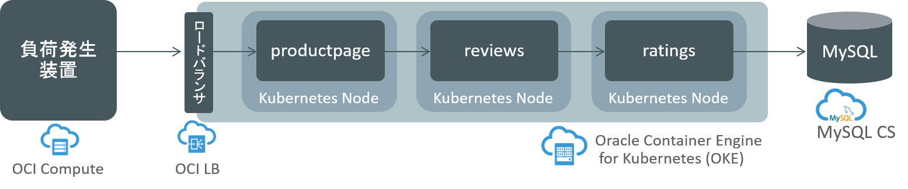
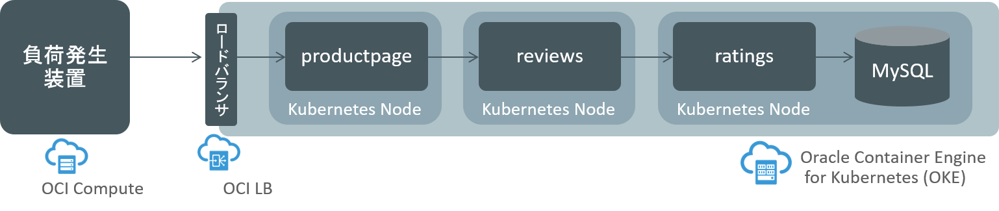
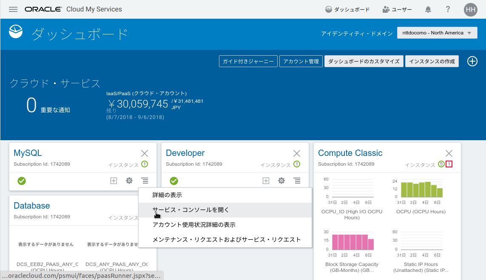
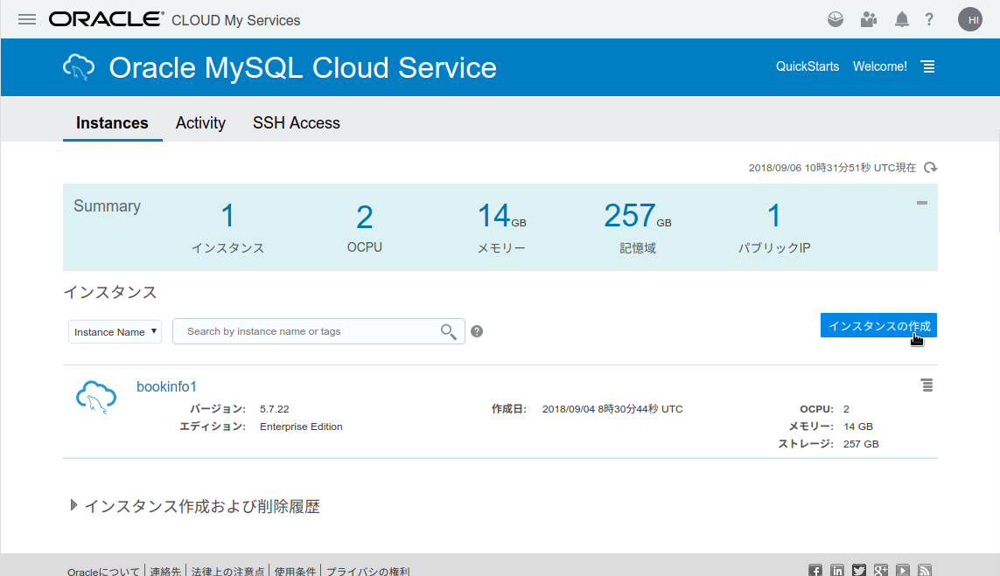
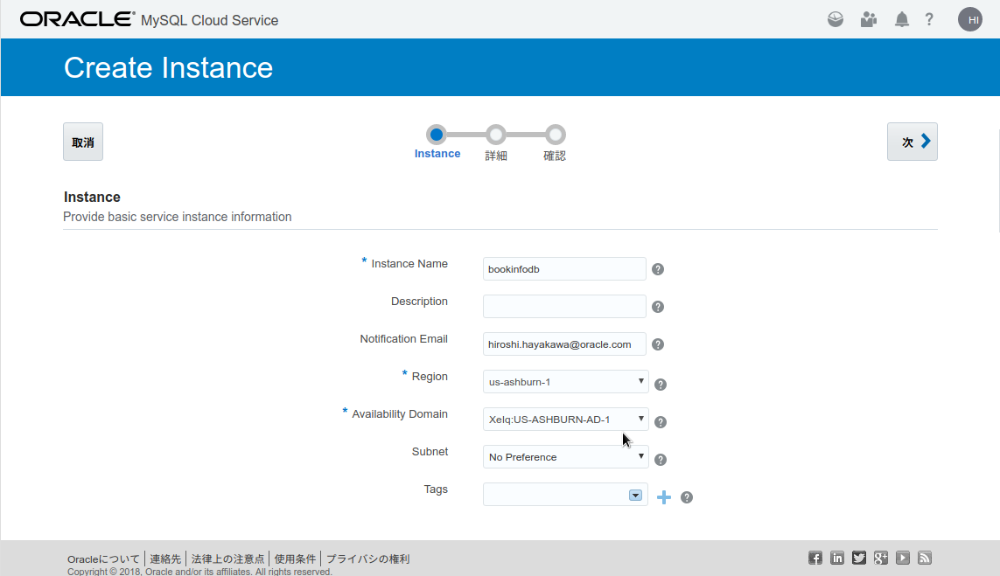
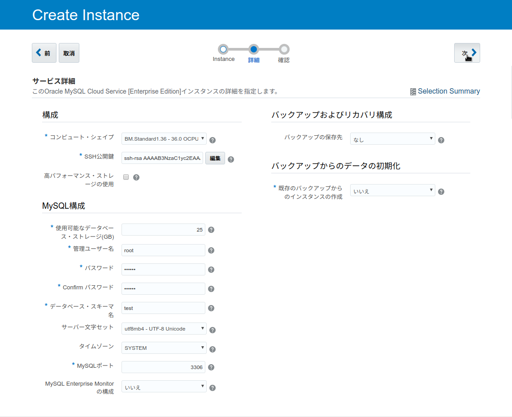
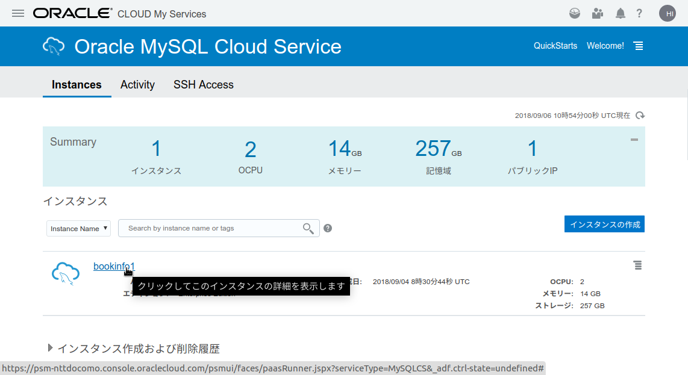
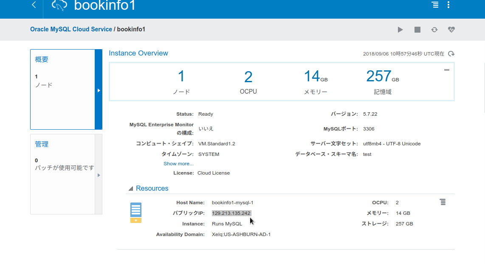
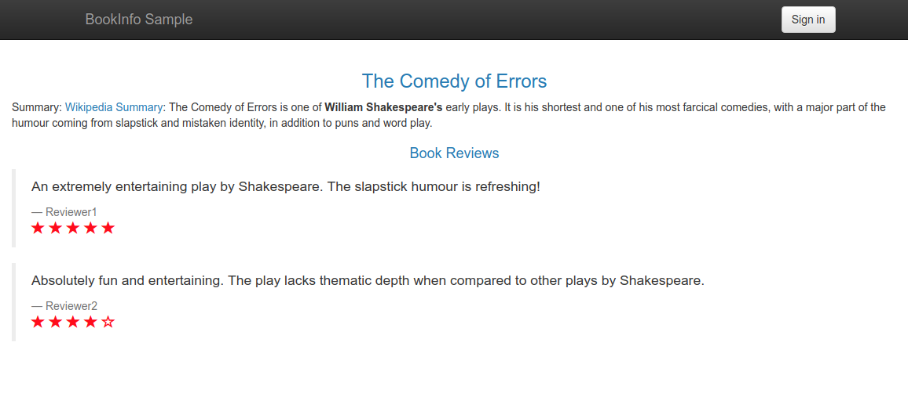

Kubernetesの負荷試験用サンプルアプリケーション
==============================================
このアプリケーションは、Istioプロジェクトが提供しているBookinfoサンプルアプリケーションを、Kubernetesの性能試験用にカスタマイズしたものです。

以下、このアプリケーションの名称をbookinfo-benchと表記します。


1 . bookinfo-benchの構成
------------------------
bookinfo-benchは、productpage、reviews、ratingsの3つのサービスと、ragingsサービスが接続する、MySQLデータベースで構成されています。<br>
raingsサービスが接続するデータベースは、Oracle MySQL Cloud Serviceのインスタンスと、Kuberntesクラスター内で動作するコンテナ化されたMySQLデータベースから選択することができます。

##### Oracle MySQL Cloud Serviceを利用する場合の構成



##### コンテナ化されたMySQLデータベースを利用する場合の構成



このアプリケーションのフロントはproductpageが担います。productpageをLoadBalancerタイプのServiceを使って公開し、ブラウザで所定のURLにアクセスすると、アプリケーションのページが表示されます。

以降、bookinfo-benchをOKEクラスターにデプロイして利用する手順を記します。


2 . 事前準備
------------
bookinfo-benchの設置を始める前の事前準備として、このリポジトリをcloneした上で、出来上がったディレクトリのトップをカレントディレクトリにしておいてください。

    git clone https://soepoc-nttdocomo.uscom-central-1.oraclecloud.com/soepoc-nttdocomo/s/soepoc-nttdocomo_soepoc_4042/scm/bookinfo-bench.git
    cd bookinfo-bench


3 . bookinfo-benchのDockerイメージのビルド
------------------------------------------
ここでは、bookinfo-benchを構成する3つのサービスと、MySQLデータベースのDockerイメージをビルドする手順を記します。

以下の手順はNTT Docomo様向けのOracle Cloud環境での作業実施を想定し、OCIのアカウントとしてsoepocユーザーを利用するものとします。環境毎に異なる部分については、適宜読み替えを行ってください。<br>
また、コンテナレジストリとして、Oracle Cloud Infrastructure Registry（以下、OCIR）を利用し、コンテナの取得に認証が必要なプライベートのレジストリを構成するものとします。


### 3.1. コンテナレジストリにログインする
プライベートレジストリを利用する場合、``docker login``コマンドを使って、コンテナレジストリにログインしておく必要があります。<br>
これは以下のようなフォーマットのコマンドとなります。

    docker login [region-code].ocir.io

この環境はデータセンター・リージョンがus-ashburn-1ですので、[region-code]にはiadを指定します。<br>
以下のコマンドを実行してください。

    docker login iad.ocir.io

ユーザー名とパスワードの入力が求められるので、順次入力していきます。<br>
ここで指定するユーザー名には、先頭に[テナント名]/を追加した文字列を用います。この環境では、nttdocomom/soepoc-adminとなります。

    Authenticating with existing credentials...
    Login did not succeed, error: Error response from daemon: Get https://iad.ocir.io/v2/: unknown: Unauthorized
    Username (gse00014510/acme-dev-admin): nttdocomo/soepoc-admin
    Password:
    WARNING! Your password will be stored unencrypted in /home/hhiroshell/.docker/config.json.
    Configure a credential helper to remove this warning. See
    https://docs.docker.com/engine/reference/commandline/login/#credentials-store

    Login Succeeded

以上のように、Login Succeededでメッセージが終われば、ログインに成功しています。


### 3.2. Dockerイメージのビルドとプッシュを行う
Dockerイメージのビルドとプッシュは、シェルスクリプトを利用して一括で実行することができます。
以下のコマンドを実行してください。

    build_push_update_images.sh v1.0.0


以上で、Dockerイメージのビルド、プッシュは完了です。


4 . Kubernetesへのデプロイ
--------------------------
ここでは、bookinfo-benchをOKEクラスターにデプロイする手順を記します。環境の条件に関しては「3 . bookinfo-benchのDockerイメージのビルド」同様です。


### 4.1. imagePullSecretの作成
imagePullSecretは、Kubernetesクラスターからコンテナレジストリにアクセスする際に、レジストリに対して送られる認証情報のことです。今回はプライベートレジストリを利用しているため、あらかじめimagePullSecretをクラスターに登録しておく必要があります。<br>
ここでは、soepoc-adminユーザーとしてOCIRにアクセスするためのimagePullSecretを作成します。

imagePullSecreを作成するには、以下のようなフォーマットのコマンドを実行します。

    kubectl create secret docker-registry soepoc-secret --docker-server=[region-code].ocir.io --docker-username='[ユーザー名]' --docker-password='[ユーザーに割り当てたOAuth Token]' --docker-email='[任意のemailアドレス]'

この環境では、具体的には以下のようなコマンドとなります。

    kubectl create secret docker-registry soepoc-secret --docker-server=iad.ocir.io --docker-username='nttdocomo/soepoc-admin' --docker-password=';N;hwzx7c:>3MB[S7SQ3' --docker-email='soepoc-admin@example.com'

ユーザーのOAuth Tokenは、OCIのコンソールでUser Settingsの中で設定することが出来ます。soepoc-adminにはすでに設定済みですが、トークンの有効期限が切れたり別のユーザーを利用する場合には、コンソールから設定し直す必要があります。

imagePullSecretの作成が完了したら、``kubectl``コマンドで結果を確認してください。soepac-secretというオブジェクトが表示されれば、作成に成功しています。

    kubectl get secret
    NAME                  TYPE                                  DATA      AGE
    default-token-r27sw   kubernetes.io/service-account-token   3         4m
    soepoc-secret         kubernetes.io/dockerconfigjson        1         10s


### 4.2. データベースの準備
bookinfo-benchのratingサービスが参照するMySQLデータベースを準備します。<br>
ratingサービスは、Oracle MySQL Cloud Serviceで構築したものと、Kubernetesクラスター内にコンテナとして立ち上げたもののどちらかを利用することができます。

利用するデータベースに応じて、以下必要な手順を参照ください。


#### 4.2.1. Oracle MySQL Cloud Serviceを利用する場合
はじめに、Oracle MySQL Cloud Service（以下、MySQL CS）をプロビジョニングします。

まず、ブラウザで以下のURLにアクセスして、Oracle Cloudのダッシュボードを表示してください。

- [https://myservices-nttdocomo.console.oraclecloud.com/mycloud/cloudportal/dashboard](https://myservices-nttdocomo.console.oraclecloud.com/mycloud/cloudportal/dashboard)

[MySQL]という名前のパネルの右下にあるハンバーガーメニューをクリックし、[サービス・コンソールを開く]を選択します。



MySQL CSのコンソールが表示されたら、[インスタンスの作成]ボタンをクリックします。



[Create Instace]ウィザートが表示されたら、[Instance]ステップで以下の値を入力し、[次]をクリックします。

- Instance Name: [任意のインスタンス名]
- Region: us-ashburn-1
- Availability Domain: [任意のドメインを選択（プルダウン方式）]
- （他の項目はデフォルトのまま）



[詳細]ステップで以下の値を入力し、[次]をクリックします。

- コンピュート・シェイプ: [目的の負荷試験にふさわしいシェイプを選択]
- SSH公開鍵: [[編集]ボタンをクリックして[Create a New Key]を選択し、キーを新規作成]
- パスワード: Welcome#1
- Confirmパスワード: [パスワードと同じ]
- データベース・スキーマ名: [test]
- バックアップの保存先: なし
- （他の項目はデフォルトのまま）



次の[確認]ステップでは入力する項目はありませんので、そのまま[作成]をクリックします。

MySQL CSインスタンスのプロビジョニングが始まります。MySQL CSのコンソールで、指定した名前のインスタンスのアイコンから砂時計の表示が消えたら、プロビジョニングは完了です。プロビジョニングの完了まで10分程度かかります。

プロビジョニングが完了したら、インスタンス名のリンクをクリックし、インスタンスの詳細情報を表示します。



このインスタンスのパブリックIPが表示されますので、これをテキストエディタにコピーしておくなどして、控えておきます。



ここまでで、MySQLデータベースのセットアップは完了です。続けて、Kubernetesクラスター上にこのデータベースにアクセスするためのServiceオブジェクトを作成します。

このServiceオブジェクトを定義したmanifestファイルは、./kubernetes/bookinfo-mysql-external.yamlです。このファイルをテキストエディタ等をで開き、22行目にあるIPアドレスをMySQL CSインスタンスのIPアドレスに修正してください。

```yaml
#######################################################
# Mysql db out of cluster
# Setup external db using credentials: root/Welcome#1
#######################################################
apiVersion: v1
kind: Service
metadata:
  name: mysqldb
spec:
  type: ClusterIP
  ports:
    - protocol: TCP
      port: 3306
---
kind: Endpoints
apiVersion: v1
metadata:
  name: mysqldb
subsets:
  - addresses:
    # FIXME: use the right IP
    - ip: 129.213.135.242
    ports:
      - protocol: TCP
        port: 3306
```

``kubectl``コマンドで、このmanifestファイルをKubernetesクラスターに適用します。

    kubectl apply -f ./kubernetes/bookinfo-mysql-external.yaml


以上で、データベースの準備は完了です。「4.3. アプリケーションのコンテナのデプロイ」に進んでください。


#### 4.2.2. コンテナ化されたMySQLデータベースを利用する場合
コンテナ化されたMySQLをKubernetesにデプロイして利用する場合には、「3 . bookinfo-benchのDockerイメージのビルド」でコンテナレジストリに登録済みのイメージを利用することができます。

これを行うためのmanifestファイルは./kubernetes/bookinfo-mysql.yamlです。以下のコマンドでmanifestファイルを適用すれば、データベースの準備が完了します。

    kubectl apply -f ./kubernetes/bookinfo-mysql.yaml

以下のコマンドで、データベースのコンテナのSTATUSがRunningになるまで少し時間をおいてください。

    kubectl get pod
    NAME                       READY     STATUS    RESTARTS   AGE
    mysqldb-7d475b7b46-bgqc4   1/1       Running   0          1m

以上で、データベースの準備は完了です。「4.3. アプリケーションのコンテナのデプロイ」に進んでください。


### 4.3. アプリケーションのコンテナのデプロイ
bookinfo-benchを構成する3つのサービスをデプロイするためのmanifestjファイルは./kubernetes/bookinfo.yamlです。
以下のコマンドでmanifestファイルを適用すれば、サービスのデプロイが完了します。

    kubectl apply -f ./kubernetes/bookinfo.yaml

この操作により、複数のServiceとPodがデプロイされます。正常にデプロイされていることを確認するため、Service、Podのそれぞれについて、一覧を表示してみます。

まず、Serviceです。

    kubectl get services

以下のように4つのServiceが表示されていることを確認してください。

    NAME          TYPE           CLUSTER-IP      EXTERNAL-IP     PORT(S)        AGE
    mysqldb       ClusterIP      10.96.92.119    <none>          3306/TCP       1m
    productpage   LoadBalancer   10.96.242.125   129.213.13.13   80:32735/TCP   1m
    ratings       ClusterIP      10.96.15.232    <none>          9080/TCP       1m
    reviews       ClusterIP      10.96.174.72    <none>          9080/TCP       1m

productpageという名前のServiceは、外部からのリクエスト受け付ける部分に当たるため、EXTERNAL-IPが払い出されています。実際にアプリケーションにアクセスする際にこのIPアドレスを利用しますので、テキストエディタ等にコピーして控えておいてください。

次にPodです。

    kubectl get pod

以下の例は、コンテナ化されたMySQLデータベースをクラスタ内で動かしている場合の表示例です。MySQL CSをデータベースに利用している場合は1番目にのmysqldbで始まるPod以外の、3つが表示されていれば問題ありません。

    NAME                             READY     STATUS    RESTARTS   AGE
    mysqldb-7d475b7b46-bgqc4         1/1       Running   0          10m
    productpage-6c587ccfcb-56g7q     1/1       Running   0          5m
    ratings-mysql-6688976fcb-vmd7f   1/1       Running   0          5m
    reviews-9ff76b56c-hpm9p          1/1       Running   0          5m

以上でOKEクラスターへのbookinfo-benchのデプロイ作業は完了です。


5 . 動作確認
------------
最後に、実際にBookinfo-benchアプリケーションにアクセスして動作確認してみます。

ここまでの手順を完了すると、クラスター外からのアクセスを受け入れるためのロードバランサーが公開された状態になっていますので、これを経由してアプリケーションにアクセスします。<br>
ロードバランサーはLoadBalancerタイプのServiceオブジェクトをOKEに配備することによってプロビジョニングされています。

このServiceオブジェクトの情報を表示することにより、公開されているIP/PORTを知ることができます。

```bash
kubectl get service productpage
```

以下のような結果が表示されることを確認してください。

```
NAME          TYPE           CLUSTER-IP      EXTERNAL-IP     PORT(S)        AGE
productpage   LoadBalancer   10.96.242.125   129.213.13.13   80:32735/TCP   14m
```

このときのEXTERNAL-IPの値が外部に公開されたIPアドレスです。また、PORT(S)の内容は80番ポートでこのServiceにアクセスできることを意味しています。

それでは、ブラウザで以下のURLにアクセスして、Bookinfoのトップページが表示されることを確認してください。

    http://[EXTERNAL-IP]/productpage



以上で、bookinfo-benchの動作確認は完了です。
